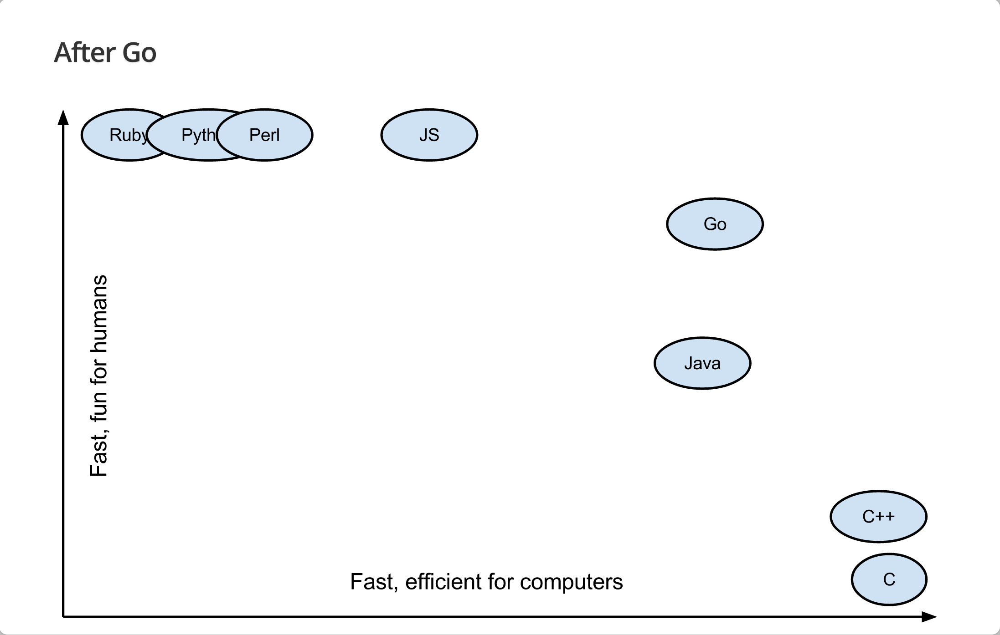
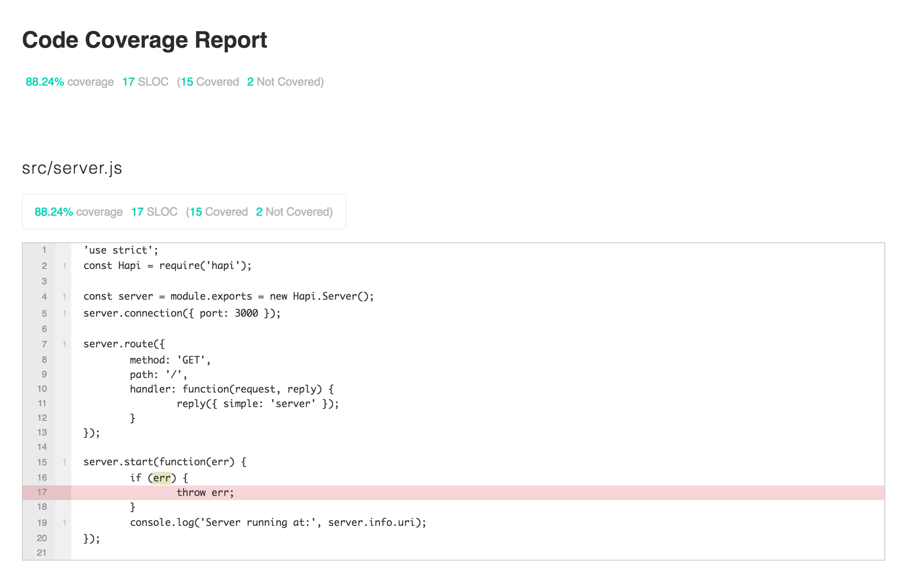

name: inverse
layout: true
class: center, middle, inverse
---
# NodeJS and JavaScript for 2016 Onwards
Server side JavaScript for API development

Beginner to intermediate

Vinay Agarwal

[](https://github.com/vinkaga/learn-node)

---
layout: false
.left-column[
  ## About
]
.right-column[

- Not an introduction to programming. Audience should be well-versed in one or more programming languages.

- Uses PHP and Java for reference

- Will not go into obvious stuff - easily guessed or Googled.

- Will not go into historical constructs.

- Focused on high performance and maintainability.

- Uses Hapi framework.

- Opinionated :-)

]
---
template: inverse

# The Basics

---
template: inverse

# The Basics
## What is it?
## Why use it?

---
layout: false
.left-column[
  ## The Basics
  ###What is it?
]
.right-column[
####JavaScript

- Dynamically typed

- Single threaded

- ECMAScript 5.1 and 6

- Full ES6 not yet supported (browsers or NodeJS)

- TypeScript supports full ES6 (not discussed here)

- https://developer.mozilla.org/en-US/docs/Web/JavaScript/Reference

####NodeJS

- An un-sandboxed JavaScript living outside of browser

- Has access to system resources

- A general purpose language - not a server

- Current version 6.2.2 (mweb uses 0.12)

- https://nodejs.org/dist/latest-v6.x/docs/api/
]
---
.left-column[
  ## The Basics
  ### What is it?
  ### Why use it?
]
.right-column[
Not too many languages are fun for humans as well as efficient for machines!

- A slide is from Go lang presentation https://talks.golang.org/2014/gocon-tokyo.slide#28


]
---
template: inverse

# The Basics
## Installing
## Updating
## Running

---
layout: false
.left-column[
  ## The Basics
  ### Installing
]
.right-column[
####OS X

- `brew install node`

####Windows

- Windows Installer at https://nodejs.org/en/download/

####Ubuntu

- `curl -sL https://deb.nodesource.com/setup_6.x | sudo -E bash -`

- `sudo apt-get install -y nodejs`
]
---
.left-column[
  ## The Basics
  ### Installing
  ### Updating
]
.right-column[

- `sudo npm cache clean -f`

- `sudo npm install -g n`

- `sudo n stable` or `sudo n 4.4.5`
]
---
.left-column[
  ## The Basics
  ### Installing
  ### Updating
  ### Running
]
.right-column[
####REPL (Read Eval Print Loop)
- `node` (equivalent to `php -a`)

- ^C twice to exit

####Run from file
- Create directory `basics`

- `cd basics`
- Create `hello.js` containing
```JavaScript
console.log('hello world!');
```
- Run with `node hello`
```
~/p/nodejs $ node hello
hello world!
```
]
---
template: inverse

# The Basics
## NPM - Node Package Manager
Like `composer` but less painful
---
name: how

.left-column[
  ## The Basics
  ### NPM
  #### - What?
]
.right-column[
####package.json

- name, version, description etc.

- license, homepage, author/contributors, repository

- dependencies, devDependencies

- scripts

####node_modules

 - holds all dependencies

####Conventions

- No equivalent of `composer.lock`

- Use exact versions for dependencies/devDependencies
]
---
.left-column[
  ## The Basics
  ### NPM
  #### - What?
  #### - How?
]
.right-column[
####package.json
- `npm init` and accept all default responses

- `npm install --save hapi`

```JSON
{
  "name": "basics",
  "version": "1.0.0",
  "description": "",
  "main": "hello.js",
  "scripts": {
    "test": "echo \"Error: no test specified\" && exit 1"
  },
  "author": "",
  "license": "ISC",
  "dependencies": {
    "hapi": "^13.4.1"
  }
}
```

- `npm install`

- `node_modules` folder
]
---
.left-column[
  ## The Basics
  ### NPM
  #### - What?
  #### - How?
]
.right-column[
####Updating dependencies
- `sudo npm -g install npm-check-updates`

- Run `ncu` to update `package.json`

####Scripts
- `npm test`

```
~/p/n/basics $ npm test

> basics@1.0.0 test /Users/vagarwal/public_html/nodejs/basics
> echo "Error: no test specified" && exit 1

Error: no test specified
npm ERR! Test failed.  See above for more details.
```

- `npm run myscript`
]
---
template: inverse

# The Basics
## Simple Server
---
.left-column[
  ## The Basics
  ### Simple Server
  #### - Editor
]
.right-column[
####WebStorm/PHPStorm

- Preferences > Languages & Frameworks > JavaScript > JavaScript language version > ECMAScript 6

- Preferences > Languages & Frameworks > JavaScript > NodeJS core library is not enabled. > Enable

####Visual Studio Code (Sublime/Atom like)
- Create `jsconfig.json` in each working folder

```JSON
{
    "compilerOptions": {
        "target": "ES6"
    },
    "exclude": [
        "node_modules"
    ]
}
```
]
---
.left-column[
  ## The Basics
  ### Simple Server
  #### - Editor
  #### - Creating
]
.right-column[
- Create `server.js` in `basics/src`

```JavaScript
'use strict';
const Hapi = require('hapi');
const server = module.exports = new Hapi.Server();
server.connection({ port: 3000 });

server.route({
	method: 'GET',
	path: '/',
	handler: function(request, reply) {
		reply({ simple: 'server' });
	}
});

server.start(function(err) {
	if (err) {
		throw err;
	}
	console.log('Server running at:', server.info.uri);
});
```

- Add the following in `package.json` > `scripts`

```
    "start": "node src/server",
```

- `npm start` and browse to http://localhost:3000/
]

---
.left-column[
  ## The Basics
  ### Simple Server
  #### - Editor
  #### - Creating
  #### - Testing
]
.right-column[
- `npm install --save-dev lab code`

- Modify `package.json` > `scripts` as follows

```
    "test": "./node_modules/lab/bin/lab"
```

- Create `test.js` in `basics/test`

```JavaScript
'use strict';
const Code = require('code');
const Lab = require('lab');
const lab = exports.lab = Lab.script();
const server = require('./server.js');

lab.experiment("Basic HTTP Tests", function() {
	lab.test('It will return simple server JSON', function(done) {
		server.inject('/', function(res) {
			Code.expect(res.statusCode).to.equal(200);
			Code.expect(res.payload).to.equal('{"simple":"server"}');
			done();
		});
	});
});
```

- `npm test`
]
---
.left-column[
  ## The Basics
  ### Simple Server
  #### - Editor
  #### - Creating
  #### - Testing
  #### - Code Coverage
]
.right-column[
- Add the following in `package.json` > `scripts`

```
"coverage": "./node_modules/lab/bin/lab -c -t 80 -r html -o coverage.html --coverage-path ./src"
```

- `npm run coverage`

- View `coverage.html` in a browser


]
---
template: inverse

# The Basics
## Language
---
.left-column[
  ## The Basics
  ### Language
  #### - Basics
]
.right-column[

- Scoped as expected: `const`, `let` - use them by default

- Function scoped: `var` - used in legacy code

- There is no `int` type, all numbers are `float`/`double`

- Use `Math.floor` or `Math.round` to convert to integer

- Strings with `'` or `"` (no interpolation)

- Use `Number()`, `String()`, `.toString()` or even implicitly

- Standard operators `+`, `-`, `*`, `/`, `%`, `++`, `--`, `+=`, `-=` etc.

- Operators apply to scalars only (unlike PHP)

- Comparison operators compare reference of objects/arrays not contents

- `typeof a` - `string`, `number`, `function`, `object` or `undefined`

- `==` vs `===` etc. - the former converts type

- `use strict;` disable legacy bad syntax
]
---
.left-column[
  ## The Basics
  ### Language
  #### - Basics
  #### - Arrays
]
.right-column[

- `let arr = ['a', ];`

- 0 indexed, never associative, trailing comma allowed

- `.length` has the number of elements in array

- Access an element with `[]`

- Iteration (more on it later)

```JavaScript
for (let i = 0, il = items.length; i < il; ++i) {
  console.log(items[i]);
}
```

- Assignment does *not* copy arrays (unlike PHP), use `arr.slice([begin[, end]])`

- `arr.push(element1, ..., elementN)`, `arr.pop()`

- `arr.unshift([element1[, ...[, elementN]]])`, `arr.shift()`

- `arr.join([separator = ','])` (like PHP `implode`)

- `str.split([separator[, limit]])` (like PHP `explode`)

- `Array.isArray(obj)` to see if a variable is array

]
---
.left-column[
  ## The Basics
  ### Language
  #### - Basics
  #### - Arrays
  #### - Objects
]
.right-column[

- `let obj = { prop: 'aval', };`

- Syntax is JSON superset, trailing comma allowed

- Keys can be integers but are converted to strings - don't use

- `Object.keys(obj)` to get property names as array

- Access a property: `obj.propName`, `obj[propInVar]` or `obj['prop-name']`

- Iteration - don't use this

```JavaScript
for (var prop in obj) {
  console.log(obj[prop]);
}
```

- No `class` keyword before ES6

- Define a class property instead of object: `.prototype`
]
---
.left-column[
  ## The Basics
  ### Language
  #### - Basics
  #### - Arrays
  #### - Objects
  #### - Functions
]
.right-column[

- Can be assigned to variables, passed as params, returned as result

- 2 ways to declare: named version hoisted to top

```JavaScript
function a(p) {
  return p * p;
}
let b = function(p) {
	return p * p;
};
```

- Alternate function syntax, AKA, lambda expression or arrow function

```JavaScript
let b = (p) => {
	return p * p;
};
```
]
---
.left-column[
  ## The Basics
  ### Language
  #### - Basics
  #### - Arrays
  #### - Objects
  #### - Functions
  #### - Modules
]
.right-column[

- Other languages use classes where NodeJS uses modules

- `require('foo')` imports what `module.exports` is assigned to

- Module name vs path: name is looked up in `node_modules` folder

- Anything can be exported

- In folder `basics`, create `sq.js` and `main.js`

```JavaScript
'use strict';
module.exports = (a) => {
	return a * a;
};
```

```JavaScript
'use strict';
const sq = require('./sq');
console.log(sq(2));
```

- `node main`

```
~/p/n/module $ node main
4
```
]
---
template: inverse

# The Quirks
---
template: inverse

# The Quirks
## Single threaded
---
.left-column[
  ## The Quirks
  ### Single threaded
]
.right-column[
- Entire JavaScript code runs in a single thread. Other threads are used for DB/HTTP/file access.

- No deadlock possible - no `synchronize`

- Data is shared among separate requests (unlike PHP)

- Multicore machines are treated as server clusters: each core runs one JavaScript thread

- No data is shared between separate threads (on different cores) of the same machine

- NodeJS [Cluster](https://nodejs.org/dist/latest-v6.x/docs/api/cluster.html)
]
---
template: inverse

# Promises, promises
---
template: inverse

# A Microservice
---

name: last-page
template: inverse

# The End
Slideshow created using [remark](http://github.com/gnab/remark).

