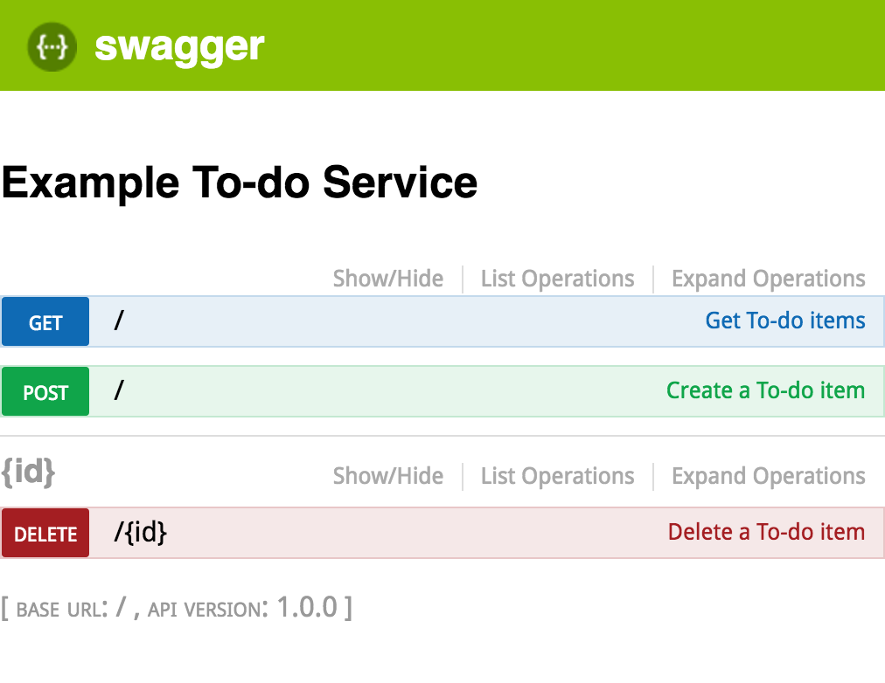
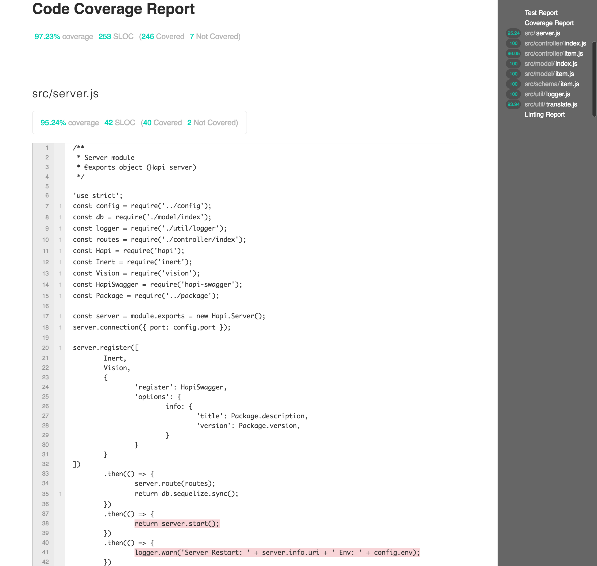

name: inverse
layout: true
class: center, middle, inverse
---
# NodeJS and JavaScript for 2016 Onwards
A server side JavaScript/NodeJS 6.x tutorial

Beginner to intermediate

Vinay Agarwal

Licensed under [CC-BY-4.0](http://creativecommons.org/licenses/by/4.0/)

[](https://github.com/vinkaga/learn-node)


---
layout: false
.left-column[
  ## About
]
.right-column[

- Not an introduction to programming. Audience should be well-versed in one or more programming languages.

- Uses PHP and Java for reference

- Will not go into obvious stuff - easily guessed or Googled

- Will not go into historical constructs.

- Focused on high performance and maintainability

- Uses Hapi framework

- Benchmark data from [vinkaga/node6perf](https://github.com/vinkaga/node6perf)

- Opinionated :-)

]
---
layout: false
.left-column[
  ## Outline
]
.right-column[

#### The Basics

- Overview from 10K ft

#### NodeJS Ecosystem

- JavaScript language, NodeJS runtime and libraries

#### The Quirks

- JavaScript can feel 'different' from other languages. These are some of those 'surprises.'

#### Promises, Promises

- Taming the async programming using promises

#### To Do Service

- A trivial service built with rigor and best practices

]
---
template: inverse

# 1. The Basics

Overview from 10K ft
.center-column[
- Overview

- NPM

- Simple Server
]
---
layout: false
.left-column[
  ## 1. Basics
  ### Overview
  #### What is it?
]
.right-column[
####JavaScript

- Dynamically typed

- JIT (Just-In-Time) compiler: no compile step needed

- ECMAScript 2015 (previously known as ES6). ES6 support is not yet complete.

- https://developer.mozilla.org/en-US/docs/Web/JavaScript/Reference

####NodeJS

- An un-sandboxed JavaScript living outside of browser

- Has access to system resources

- A general purpose language - not a server

- Current version 6.3.0. Supports almost all ES6 (https://kangax.github.io/compat-table/es6/)

- https://nodejs.org/dist/latest-v6.x/docs/api/
]
---
.left-column[
  ## 1. Basics
  ### Overview
  #### What is it?
  #### Why use it?
]
.right-column[
Not too many languages are fun for humans as well as efficient for machines!

- A slide is from Go lang presentation https://talks.golang.org/2014/gocon-tokyo.slide#28


]

---
layout: false
.left-column[
  ## 1. Basics
  ### Overview
  #### What is it?
  #### Why use it?
  #### Installing
]
.right-column[
####OS X

```
brew update
brew upgrade
brew install node
```
####Windows

- Windows Installer at https://nodejs.org/en/download/

####Ubuntu

- `curl -sL https://deb.nodesource.com/setup_6.x | sudo -E bash -`

- `sudo apt-get install -y nodejs`

####Updating

```
sudo npm cache clean -f
sudo npm install -g n
sudo n stable

```
]
---
.left-column[
  ## 1. Basics
  ### Overview
  #### What is it?
  #### Why use it?
  #### Installing
  #### Running
]
.right-column[
####REPL (Read Eval Print Loop)
- `node` (equivalent to `php -a`)

- ^C twice to exit

####Run from file
- Create directory `basics`

- `cd basics`
- Create `hello.js` containing
```JavaScript
console.log('hello world!');
```
- Run with `node hello`
```
~/lean-node/basics $ node hello
hello world!
```
]
---
name: how

.left-column[
  ## 1. Basics
  ### NPM
  #### What?
]
.right-column[
####package.json

- name, version, description etc.

- license, homepage, author/contributors, repository

- dependencies, devDependencies

- scripts

####node_modules

 - holds all dependencies

####Best Practices

- Use exact versions for dependencies. No equivalent of PHP `composer.lock`.

- Include scripts - anyone knows how to run or test

]
---
.left-column[
  ## 1. Basics
  ### NPM
  #### What?
  #### How?
]
.right-column[
####package.json
- `npm init`

- `npm install --save hapi`

```JSON
{
  "name": "basics",
  "version": "1.0.0",
  "description": "",
  "main": "hello.js",
  "scripts": {
    "test": "echo \"Error: no test specified\" && exit 1"
  },
  "author": "",
  "license": "MIT",
  "dependencies": {
    "hapi": "^13.4.1"
  }
}
```

- `npm install`

- `node_modules` folder
]
---
.left-column[
  ## 1. Basics
  ### NPM
  #### What?
  #### How?
]
.right-column[
####Updating dependencies
- `sudo npm -g install npm-check-updates`

- Run `ncu` to update `package.json`

####Scripts
- `npm test`

```
~/p/n/basics $ npm test

> basics@1.0.0 test /Users/vagarwal/public_html/nodejs/basics
> echo "Error: no test specified" && exit 1

Error: no test specified
npm ERR! Test failed.  See above for more details.
```

- `npm run myscript`
]
---
.left-column[
  ## 1. Basics
  ### Simple Server
  #### Editor
]
.right-column[
####WebStorm/PHPStorm

- Preferences > Languages & Frameworks > JavaScript > JavaScript language version > ECMAScript 6

- Preferences > Languages & Frameworks > JavaScript > NodeJS core library is not enabled. > Enable

####Visual Studio Code (Sublime/Atom like)
- Create `jsconfig.json` in each working folder

```JSON
{
    "compilerOptions": {
        "target": "ES6"
    },
    "exclude": [
        "node_modules"
    ]
}
```
]
---
.left-column[
  ## 1. Basics
  ### Simple Server
  #### Editor
  #### Creating
]
.right-column[
- Create `server.js` in `basics/src`

```JavaScript
'use strict';
const Hapi = require('hapi');
const server = module.exports = new Hapi.Server();
server.connection({ port: 3000 });

server.route({
	method: 'GET',
	path: '/',
	handler: function(request, reply) {
		reply({ simple: 'server' });
	}
});

server.start(function(err) {
	if (err) {
		throw err;
	}
	console.log('Server running at:', server.info.uri);
});
```

- Add the following in `package.json` > `scripts`

```
    "start": "node src/server",
```

- `npm start` and browse to http://localhost:3000/
]

---
.left-column[
  ## 1. Basics
  ### Simple Server
  #### Editor
  #### Creating
  #### Debugging
]
.right-column[

####By Printing

- Simply printing through `console.log` can be the fastest way to debug

####Debugger

- Debugger is helpful in more complex debug situations 

- Allows debugging on remote servers

- [WebStorm/PHPStorm NodeJS debug setup](https://www.jetbrains.com/help/webstorm/2016.2/running-and-debugging-node-js.html)

- [Visual Studio Code NodeJS debug setup](https://code.visualstudio.com/docs/editor/debugging)

- Debug demos

]

---
.left-column[
  ## 1. Basics
  ### Simple Server
  #### Editor
  #### Creating
  #### Debugging
  #### Testing
]
.right-column[
- `npm install --save-dev lab code`

- Modify `package.json` > `scripts` as follows

```
    "test": "./node_modules/lab/bin/lab"
```

- Create `test.js` in `basics/test`

```JavaScript
'use strict';
const server = require('../src/server.js');
const Code = require('code');
const Lab = require('lab');
const lab = exports.lab = Lab.script();
const describe = lab.describe;
const it = lab.it;
const expect = Code.expect;

describe("Basic HTTP Tests", function() {
	it('should return simple server JSON', function() {
		return server.inject('/').then(function(res) {
			expect(res.statusCode).to.equal(200);
			expect(res.payload).to.equal('{"simple":"server"}');
		});
	});
});
```

- `npm test`
]
---
.left-column[
  ## 1. Basics
  ### Simple Server
  #### Editor
  #### Creating
  #### Debugging
  #### Testing
  #### Code Coverage
]
.right-column[
- Add the following in `package.json` > `scripts`

```
"coverage": "./node_modules/lab/bin/lab -c -t 80 -r html -o coverage.html --coverage-path ./src"
```

- `npm run coverage`

- View `coverage.html` in a browser


]
---
template: inverse

# 2. NodeJS Ecosystem
Language and Runtime
.center-column[
- JavaScript Language
- NodeJS Runtime
- Libraries
]
---
.left-column[
  ## 2. NodeJS
  ### Language
  #### Basics
]
.right-column[

- Declaration: `const`, `let` - block scoped, preferred

- Function scoped declaration: `var` - used in legacy code

- There is no `int` type, all numbers are `float`. Use `Math.floor` or `Math.round` to convert to integer

- There is no typecasting - use `Number()`, `String()`, `.toString()` or implicit conversion

- Use `!` or `!!` to convert to boolean

- Standard operators `+`, `-`, `*`, `/`, `%`, `++`, `--`, `+=`, `-=` etc.

- Comparison operators compare reference of objects/arrays not contents

- `null` is different from `undefined` - prefer `undefined`

- `typeof`: `string`, `number`, `function`, `object` or `undefined`

- `==` vs `===` etc. - the former converts type

- `'use strict';` disable legacy bad syntax
]
---
.left-column[
  ## 2. NodeJS
  ### Language
  #### Basics
  #### Strings
]
.right-column[

```JavaScript
let s1 = 'astring';
let s2 = "another\nstring";
let s3 = `string in
multiple lines`;
```

- Comparison operators compare content (unlike Java)

- Template support using `

```
let a = 'QuX';
let b = `bbb${a.toLowerCase()+'y'}eee`; // bbbquxyeee
```

- `.length` gives the number of characters

- `.startsWith`, `.endsWith`, `.includes` functions

- `.slice` vs `.substr`/`.substring`: use `.slice`

- `.concat` is limiting and *3x* slower than `+`: use `+`

- Spread operator `...` explodes to array of chars

]
---
.left-column[
  ## 2. NodeJS
  ### Language
  #### Basics
  #### Strings
  #### Arrays
]
.right-column[

- `let arr = ['a', ];`

- 0 indexed, never associative, trailing comma allowed

- `.length` gives the number of elements

- Access an element with `[]`

- Iteration: use `for` (fastest) or `for-of` (*2-3x* slower). `forEach` is *7x* slower.

```JavaScript
for (let i = 0, il = items.length; i < il; ++i) {
  console.log(items[i]);
}
for (let item of items) {
  console.log(item);
}
```

- Assignment does *not* copy arrays (like PHP), use `slice`

- `push`, `pop`, `shift`, `unshift`

- `join` and string `split` (like PHP `implode` and `explode`)

- `obj instanceof Array` to see if a variable is array

- Spread operator `...` to merge arrays `a1.push(...a2)`

]
---
.left-column[
  ## 2. NodeJS
  ### Language
  #### Basics
  #### Arrays
  #### Functions
]
.right-column[

- Can be assigned to variables, passed as params, returned as result

- 2 ways to declare: named version hoisted to top

```JavaScript
function a(p = 2) {
  return p * p;
}
let b = function(p = 2) {
	return p * p;
};
```

- Alternate syntax, AKA, arrow function or lambda expression (doesn't define its own `this`)

```JavaScript
let b = (p = 2) => {
	return p * p;
};
let c = (p = 2) => (p * p);
```

- Default parameter value used when parameter is not provided or is `undefined`

```
let c = b();           // 4
let d = b(undefined);  // 4
```
]
---
.left-column[
  ## 2. NodeJS
  ### Language
  #### Basics
  #### Arrays
  #### Functions
  #### Objects
]
.right-column[

- `let obj = { prop: 'aval', };`

- Syntax is JSON superset, trailing comma allowed

- Keys are strings (and Symbols)

- `Object.keys(obj)` returns property names (own not inherited)

- Access a property: `obj.propName`, `obj[propInVar]` or `obj['prop-name']`

- Iteration includes inherited properties

```JavaScript
for (var prop in obj) {
  if (obj.hasOwnProperty(prop)) {
    console.log(obj[prop]);
  }
}
```
]
---
.left-column[
  ## 2. NodeJS
  ### Language
  #### Basics
  #### Arrays
  #### Functions
  #### Objects
  #### Maps
]
.right-column[

- Like objects, stores key values. Keys can be non-string.

- Uses `get`/`set` syntax (unlike objects). `size` returns number of keys.

```JavaScript
let map = new Map();
map.set('a string', 'a val');
map.get('a string');  // 'a val'
let key = {};
map.set(key, 'obj val');
map.get(key);         // 'obj val'
map.get({});          // undefined
map.size;             // 2
```

```JavaScript
for (let key of map.keys()) {
  console.log(key);
}
for (let value of map.values()) {
  console.log(value);
}
for (let [key, value] of map.entries()) {
  console.log(key + " = " + value);
}
```

- Faster than objects but many libraries expect objects instead of maps

]
---
.left-column[
  ## 2. NodeJS
  ### Language
  #### Basics
  #### Arrays
  #### Functions
  #### Objects
  #### Maps
  #### Classes
]
.right-column[

```JavaScript
class Point {
	constructor(x, y) {
		this.x = x;
		this.y = y;
	}
	static distance(a, b) {
		return Math.sqrt((a.x-b.x)*(a.x-b.x)+(a.y-b.y)*(a.y-b.y));
	}
	getName() {
		return this.constructor.name;
	}
    get area() {
        return this.x*this.y;
    }
}
class Point3D extends Point {
	constructor(x, y, z) {
		super(x, y);
		this.z = z;
	}
}
let p = new Point(10, 11);
let cp = new Point3D(1, 2, 3);
p.getName();
cp.getName();
Point3D.distance(p, cp);
cp.area;
```

- Use named functions for members, arrow functions cause unexpected behavior

- No private keyword - use closure or WeakMap
]
---
.left-column[
  ## 2. NodeJS
  ### Language
  #### Basics
  #### Arrays
  #### Functions
  #### Objects
  #### Maps
  #### Classes
  #### Namespace
]
.right-column[

- No namespaces - extra steps needed to avoid name-collision.

- Blocks limit `let` declarations but not `var` or `function`

```JavaScript
{
  function hello() { console.log('hello'); }        // Global
  var hola = function() { console.log('hola'); };   // Global
  let world = function() { console.log('world'); }; // Local
}
```

- Legacy code uses Immediately-Invoked Function Expressions to limit scope

```JavaScript
(function(){
  function hello() { console.log('hello'); }        // Local
  var hola = function() { console.log('hola'); };   // Local
}());
```

- All declarations in NodeJS modules are forced local

]
---
.left-column[
  ## 2. NodeJS
  ### Language
  #### Basics
  #### Arrays
  #### Functions
  #### Objects
  #### Maps
  #### Classes
  #### Namespace
  #### Misc
]
.right-column[

####Generators

- An alternate way for handling async operations - not convenient to use

####Symbols

- Designed to avoid conflict with a library object keys

- Provide hooks to library objects

####Reflect

```JavaScript
let yay = Reflect.defineProperty(target, 'foo', { value: 'bar' });
let deleted = Reflect.deleteProperty(target, 'foo');
```

####Proxy

- Used to do something whenever the properties of a target object are accessed

]
---
.left-column[
  ## 2. NodeJS
  ### Runtime
  #### Overview
]
.right-column[

####Globals
- `__dirname`, `__filename`

- `console` and `process`

####process.env.NODE_ENV

- `process.env` has environment variables

- By convention `NODE_ENV` stores `production` or another run-time environment. If defaults to `development`.

- App behavior can be customized based on this run-time environment. Many libraries automatically change their behavior when it's set to `production`.

- Environment can be set as follows on UNIX/Mac
```
NODE_ENV=production npm start
```

- On Windows
```
set NODE_ENV=production && npm start
```

]
---
.left-column[
  ## 2. NodeJS
  ### Runtime
  #### Overview
  #### API
]
.right-column[

- File system: `fs` and `path`

- `http`/`https`: typically used through a library

- Multicore CPU support: [`cluster`](https://nodejs.org/dist/latest-v6.x/docs/api/cluster.html)


- All functionality accessed as modules (see below)

- Async functions have following calling convention

```JavaScript
somefunc([params, params], callback);
// E.g.
const fs = require('fs');
fs.unlink('/tmp/hello', (err) => {
  if (err) throw err;
  console.log('successfully deleted /tmp/hello');
});

```

- Use Promises instead of callbacks (discussed later): less code, more maintainable
]
---
.left-column[
  ## 2. NodeJS
  ### Runtime
  #### Overview
  #### API
  #### Events
]
.right-column[

- NodeJS [Events](https://nodejs.org/api/events.html) let apps create and consume custom events

```JavaScript
const Event = require('events');
class MyEvent extends Event {}

const myEvent = new MyEvent();

// Listen for an event
myEvent.on('crzy', function(name) {
	console.log('Occurred:', name);
});

// Send out an event
myEvent.emit('crzy', 'crazy event');
```
]

---
.left-column[
  ## 2. NodeJS
  ### Runtime
  #### Overview
  #### API
  #### Events
  #### Module
]
.right-column[

- NodeJS defined interface for libraries and components

- Each module is defined in one file: can use other files (also modules)

- Contents of a module files are wrapped in

```JavaScript
(function (exports, require, module, __filename, __dirname) {
	// let exports = module.exports = {};
    // Contents of module file are inserted here
    // Declarations are local
});
```

- All declarations are local to module

- Exports `module.exports`, an object; `exports` refers to `module.exports`

- To export a single item, assign `module.exports` to it. To export multiple items, add them to `exports` object

- `require('foo')` imports what `foo` exports

- Module name vs path: name is looked up in `node_modules` folder

- Modules are cached - repeated `require` *does not* repeatedly execute module code
]

---
.left-column[
  ## 2. NodeJS
  ### Runtime
  #### Overview
  #### API
  #### Events
  #### Module
  #### Create Module
]
.right-column[
- In folder `nodejs`, create `sq.js`

```JavaScript
'use strict';
module.exports = (a) => {
	return a * a;
};
```

- Also create `main.js`

```JavaScript
'use strict';
const sq = require('./sq');
console.log(sq(2));
```

- Run it

```
~/p/n/module $ node main
4
```
]
---
.left-column[
  ## 2. NodeJS
  ### Libraries
]
.right-column[

- [`lodash`](https://lodash.com/docs): Extension to basic JavaScript functionality 

- [`async`](http://caolan.github.io/async/): Serial/parallel I/O made easy

- [`bluebird`](http://bluebirdjs.com/docs/api-reference.html): A better promise than that in ES6

- ORM/ODM: [`sequelize`](http://docs.sequelizejs.com/en/latest/), [`mongoose`](http://mongoosejs.com/docs/guide.html) (not recommending MongoDB)

- Logging: [`winston`](https://github.com/winstonjs/winston), [`bunyan`](https://github.com/trentm/node-bunyan)

- Servers: [`express`](http://expressjs.com/en/4x/api.html), [`meteor`](http://docs.meteor.com/#/full/) (not pure JS), [`hapi`](http://hapijs.com/api)

- Testing: [`mocha`](https://mochajs.org/), [`jasmine`](http://jasmine.github.io/2.4/introduction.html)

- Production: [`pm2`](http://pm2.keymetrics.io/)

]

---
template: inverse

# 3. The Quirks
What may surprise you
.center-column[
- Quiet
- Single Threaded
- Objects v. Primitives
- `this`
- Sequential I/O
- Exceptions
- Closures
]
---
.left-column[
  ## 3. Quirks
  #### Quiet
]
.right-column[

- JavaScript *does not* produce errors where other languages would

####Objects

```JavaScript
let o = {a:1};
console.log(o.b);  // undefined, no unknown property error
```

####Arrays

```JavaScript
let a = [1];
console.log(a[2]);     // undefined, no index out of bounds error
console.log(a[-1]);    // undefined, no index out of bounds error
console.log(a.myprop); // undefined, no illegal operation error (arrays are objects)
a['aprop'] = 'red';    // No illegal operation error
console.log(a);        // [ 1, aprop: 'red' ] what???
console.log(a.length); // 1 not 2!!!
```

####Primitives

```JavaScript
console.log((2).aprop);   // undefined, no illegal operation error
console.log('str'.aprop); // undefined, no illegal operation error
console.log(true.aprop);  // undefined, no illegal operation error
```

####`undefined`, `null` do generate error

```JavaScript
console.log(undefined.aprop); // TypeError: Cannot read property 'aprop' of undefined
console.log(null.aprop);      // TypeError: Cannot read property 'aprop' of null
```


]
---
.left-column[
  ## 3. Quirks
  #### Quiet
  #### Single threaded
]
.right-column[

- Like PHP, each request runs in a single thread. But unlike PHP, multiple requests share instantiated classes and data in memory.

- Unlike Java, deadlock not possible - no `synchronize`

- No data is shared between separate threads of the same machine

- Multi-core CPUs are treated as server clusters: each core runs one JavaScript thread. Use `cluster` or `pm2` to fully utilize multi-core CPUs.

- All I/O are executed asynchronously.

```JavaScript
const fs = require('fs');
let txt = 'nothing';
fs.readFile('hello.txt', function(data) {
	txt = data; 	// data = 'hello'
});
console.log(txt);   // nothing
```

- There isn't any sleep like function, use `setTimeout`

```JavaScript
setTimeout(callback, delay);
```

]
---
.left-column[
  ## 3. Quirks
  #### Quiet
  #### Single threaded
  #### Objects v. Primitives
]
.right-column[

- Objects: `Object`, `Array`, `Function`, `Map`, `Symbol`, `Date`, `Error`, `RegExp`, `Math`, `Reflect` ...

- Primitives: `Number`, `String`, `Boolean`, `undefined`. (Use `undefined` where you would use `null` in other languages.)

- Primitives can be used like objects

```JavaScript
3.14.toString();              // '3.14'
'     somestring   '.trim();  // 'somestring'
```

- Check types of primitives: `typeof`

```JavaScript
typeof 2;         // 'number'
typeof '';        // 'string'
typeof true;      // 'boolean'
typeof undefined; // 'undefined'

```

- Check type of objects: `instanceof`

```JavaScript
[] instanceof Array;                // true
(function(){}) instanceof Function; // true
(()=>{}) instanceof Function;       // true
(new Map()) instanceof Map;         // true

```
]
---
.left-column[
  ## 3. Quirks
  #### Quiet
  #### Single threaded
  #### Objects v. Primitives
  #### `this`
]
.right-column[

- Object methods using `this` 

```JavaScript
class Person {
	constructor(first, last) {
		this.first = first;
		this.last = last;
	}
	showName() {
		console.log(this.first + " " + this.last);
	}
}
let person = new Person('Brad', 'Pitt');
person.showName();                            // 'Brad Pitt'
setTimeout(person.showName, 10);              // 'undefined undefined'
setTimeout(person.showName.bind(person), 10); // 'Brad Pitt'
```
]

---
.left-column[
  ## 3. Quirks
  #### Quiet
  #### Single threaded
  #### Objects v. Primitives
  #### `this`
]
.right-column[

- `this` in inner function

```JavaScript
class Golf {
	constructor() {
		this.tournament = 'Masters';
		this.data = ['Woods', 'Mickelson'];
	}
	showPlayers() {
		this.data.forEach(function(player) {
			console.log(player + ' in ' + this.tournament);
		});
	}
	showPlayers2() {
		this.data.forEach((player) => {
			console.log(player + ' in ' + this.tournament);
		});
	}
}
let golf = new Golf();
golf.showPlayers();   // TypeError: Cannot read property 'tournament' of undefined
golf.showPlayers2();  // OK
```

]
---
.left-column[
  ## 3. Quirks
  #### Quiet
  #### Single threaded
  #### Objects v. Primitives
  #### `this`
  #### Sequential I/O
]
.right-column[

- Sequential I/Os are surprisingly tedious. An account creation may have 3 steps
 1. Create user in DB
 2. Create email in DB
 3. Send verification email

```JavaScript
db.user.create(userin, function(err, userout) {
	db.email.create(emailin,  function(err, emailout) {
		mailutil.send(payload, function(err) {
			console.log('Account creation ' + (err ? 'error' : 'success'));
		});
	});
});

```

- Requirements change and another step between 2 & 3 is needed - take credit card. Using [`async`](http://caolan.github.io/async/)

```JavaScript
async.series([
	function(cb) {db.user.create(userin, cb)},
	function(cb) {db.email.create(emailin, cb)},
	function(cb) {mailutil.send(payload, cb)},
], function(err) {
	console.log('Account creation ' + (err ? 'error' : 'success'));
});
```

- Sequential operations using promises discussed later
]
---
.left-column[
  ## 3. Quirks
  #### Quiet
  #### Single threaded
  #### Objects v. Primitives
  #### `this`
  #### Sequential I/O
  #### Exceptions
]
.right-column[

- Exception 'err_one' is caught as expected

```JavaScript
function one() {
	throw new Error('err_one');
	return 'one';
}
try {
	one();
} catch (e) {
	console.log('Caught: ' + e.message);
}
```

- Exception 'err_two' is *not* caught

```JavaScript
function two() {
	setTimeout(function() {
		throw new Error('err_two');
	}, 10);
	return 'two';
}
try {
	two();
} catch (e) {
	console.log('Caught: ' + e.message);
}
```

- Don't throw exceptions in async or mixed code - use [Events](https://nodejs.org/api/events.html) or `Promise.reject`
]
---
.left-column[
  ## 3. Quirks
  #### Quiet
  #### Single threaded
  #### Objects v. Primitives
  #### `this`
  #### Sequential I/O
  #### Exceptions
  #### Closures
]
.right-column[

- Closures keep access to outer scopes where they were defined (unlike object functions)

```JavaScript
function counter(start) {
    let count = start;
    return {
        increment: function() {
            count++;
        },

        get: function() {
            return count;
        }
    }
}
var foo = counter(4);
foo.increment();
foo.get();            // 5
```

- `increment` and `get` have access to `count`!
]
---
.left-column[
  ## 3. Quirks
  #### Quiet
  #### Single threaded
  #### Objects v. Primitives
  #### `this`
  #### Sequential I/O
  #### Exceptions
  #### Closures
]
.right-column[

- Don't use `var` for closures inside loops

```JavaScript
// This doesn't work as intended
for (var i = 0; i < 5; i++) {
	setTimeout(function() {
		console.log(i);
	}, 1);
}
// This one does
for (let i = 0; i < 5; i++) {
	setTimeout(function() {
		console.log(i);
	}, 1);
}
```

- More details at [MDN let](https://developer.mozilla.org/en-US/docs/Web/JavaScript/Reference/Statements/let)
]
---
template: inverse

# 4. Promises, promises
Async code made easier
.center-column[
- What?
- Properties
- Usage
- Overhead
]
---
.left-column[
  ## 4. Promises
  ### What?
]
.right-column[

- Async operation reality

```JavaScript
let user;
db.user.read(id, function(err, data) {
	user = data;
});
console.log(data);   // undefined
```

- But the following is the most convenient for programming

```JavaScript
let user = db.user.read(id);
console.log(user);   // user from DB
```

- Requires implicit wait after the `db.user.read`

- What if `db.user.read` returned a 'container' that will automatically get the result when it becomes available

- This container can be passed just like result

- Reading the result (from the container) requires 'unwrap' operation (with implicit wait)

- Such a container is called a promise (a Future in Java)

- Standard promise spec [Promises/A+](https://promisesaplus.com/)

]
---
.left-column[
  ## 4. Promises
  ### What?
  ### Properties
]
.right-column[

- `then` is the unwrap function (has implicit wait)

```JavaScript
let promise = db.user.read(id);
promise.then(function(data) {
	// data is result of the promise
}, function(err) {
	// err is the error occurred in operation
});
```

- Promises are stateful and have 3 states

1. Pending
2. Resolved (successful)
3. Rejected (error occurred)

- Once resolved/rejected, a promise cannot change state

- To create a promise

```JavaScript
let promise = new Promise(function(resolve, reject) {
	// resolve and reject are function
	if (...) {
		resolve(somevalue);
		return;
	}
	...
	reject(someerror);
});
```
]
---
.left-column[
  ## 4. Promises
  ### What?
  ### Properties
  ### Usage
]
.right-column[

- Alternative syntax

```JavaScript
Promise.resolve(val);     // Creates a promise with success value = val
Promise.reject(err);      // Creates a promise with rejection error = err
promise.then(sucessfunc); // Unwrap shortcut promise.then(successfunc, undefined);
promise.catch(errfunc);   // Unwrap shortcut promise.then(undefined, errfunc):
```

- Promises are chainable

```JavaScript
db.user.create(userin)
.then(db.email.create(emailin))
.then(mailutil.send(payload))
.catch(errfunc); // Handles errors from all previous steps
```

- A promise is passed up the chain till the next suitable handler is found

- Promises can be unwrapped, modified and put back in the chain

```JavaScript
db.user.create(userin)
.then(function(user) {
	return (user.id % 2) ? Promise.reject('odd user') : Promise.resolve(user);
})
.then(db.email.create(emailin))
.then(mailutil.send(payload))
.catch(...);
```

]
---
.left-column[
  ## 4. Promises
  ### What?
  ### Properties
  ### Usage
]
.right-column[

- Sequential operations

```JavaScript
db.user.create(userin)
.then(db.email.create(emailin))
.then(mailutil.send(payload))
.catch(errfunc); // Handles errors from all previous steps
```

- Parallel operations

```JavaScript
Promise.all([
	db.user.create(userin),
	db.group.create(groupin),
	remoteResource.get(resourceId),
]).then(...)
.catch(...);
```

- A single `then` unwraps a promise no matter how deep

```JavaScript
Promise.resolve('one level').then((r) => {
	console.log(r);  // one level
});
Promise.resolve(Promise.resolve(Promise.resolve('3 level'))).then((r) => {
	console.log(r);  // 3 level
});
```
]
---
.left-column[
  ## 4. Promises
  ### What?
  ### Properties
  ### Usage
]
.right-column[

- If no rejection handler found: Unhandled rejection error

```JavaScript
const Promise = require('bluebird');
function some() {
	return Promise.reject('some error');
}
some().then(function(res) {
	console.log(res); // Unhandled rejection some error
});
```

- Best practice: make all async interfaces promises

]
---
.left-column[
  ## 4. Promises
  #### What?
  #### Properties
  #### Usage
  #### Overhead
]
.right-column[

- Promises have overhead - some better than others. [Bluebird benchmark](https://github.com/petkaantonov/bluebird/tree/master/benchmark)

```
file                                   time(ms)  memory(MB)
                     Sequential
callbacks-baseline.js                      232       35.86
promises-bluebird-generator.js             235       38.04
promises-bluebird.js                       335       52.08
promises-cujojs-when.js                    405       75.77
promises-tildeio-rsvp.js                   468       87.56
promises-dfilatov-vow.js                   578      125.98
callbacks-caolan-async-waterfall.js        634       88.64
promises-lvivski-davy.js                   653      109.64
promises-ecmascript6-native.js            1348      189.29
promises-then-promise.js                  1571      294.45
promises-medikoo-deferred.js              2091      262.18
observables-Reactive-Extensions-RxJS.js   3201      356.76
promises-kriskowal-q.js                   9952      694.23

                     Parallel
callbacks-baseline.js                      211       25.57
promises-bluebird.js                       389       53.49
promises-bluebird-generator.js             491       55.52
promises-tildeio-rsvp.js                   785      108.14
promises-dfilatov-vow.js                   798      102.08
promises-cujojs-when.js                    851       60.46
promises-lvivski-davy.js                  1298      135.43
callbacks-caolan-async-parallel.js        1780      101.11
promises-then-promise.js                  2438      338.91
promises-ecmascript6-native.js            3532      301.96
promises-medikoo-deferred.js              4207      357.60
```

]
---
template: inverse

# 5. To Do Service
A trivial service built with rigor and best practices
.center-column[
- Overview
- Components
- Validation
- Scripts
- Documentation
- Coverage
]
---
.left-column[
  ## 5. To Do Service
  ### Overview
  #### Goals
]
.right-column[

- Create a REST microservice using realistic components

- Store data in a DB (MySQL)

- Consume a third party REST service in the microservice

- Validate inputs and outputs against schema

- Generate documentation automatically

- Create appropriate tests

- Measure code coverage

- Test business critical business areas extensively

]
---
.left-column[
  ## 5. To Do Service
  ### Overview
  #### Goals
  #### Description
]
.right-column[

- REST service to store to-do list. 

- To-do items and their Spanish translations are stored. Server uses [Yandex](https://translate.yandex.com/developers) service.

- No users, accounts or authentication

- Uses [Hapi framework](http://hapijs.com/api)

- DB storage through [Sequelize ORM](http://docs.sequelizejs.com/en/latest/)

- REST client [Request](https://github.com/request/request)

- REST client promise interface [Request-Promise](https://github.com/request/request-promise)

- Promise library [Bluebird](http://bluebirdjs.com/docs/getting-started.html)

- Logging with [Bunyan](https://github.com/trentm/node-bunyan)

]
---
.left-column[
  ## 5. To Do Service
  ### Overview
  #### Goals
  #### Description
  #### Plan
]
.right-column[

- Build from bottom up - low-level components first, high-level later

- Create tests for components along the way

- `npm init` 

- Create other folders as follows

```
src
  model
  controller
  util
  schema
test
  model
  controller
  util
documentation
package.json
```

- `npm install --save hapi sequelize mysql request-promise bluebird bunyan hapi-swagger inert vision`

- `npm install --save-dev lab code`

- `sudo npm install -g bunyan lab npm-check-updates`

- Use exact version of dependencies: remove `^`

]
---
.left-column[
  ## 5. To Do Service
  ### Overview
  ### Components
  #### Config
]
.right-column[

- Components reference code `./todo` GIT tag `prevalidation`

- Server global config `config.js` in project root, depends on run environment

```JavaScript
const env = process.env.NODE_ENV || 'development';
const configs = {
	development: {
		port: 3000,
		db: {
			name: 'todo-dev',
			username: 'root',
			password: 'mysql',
			dialect: 'mysql',
			host: 'localhost',
			port: 3306
		},
		translate: {
			url: 'https://translate.yandex.net/api/v1.5/tr.json/translate',
			key: 'trnsl.1.1.20160805T143434Z.8ad64dde3d4eea98.6632d4e5d70a8856294dca911558615dd5ce1c4c',
			lang: 'es',
		},
		logger: {
			name: 'todo-dev',
			level: 'info',
			stream: process.stdout,
		},
	},
	test: {},
	production: {},
};
const config = module.exports = configs[env];
config.env = env;
```
]
---
.left-column[
  ## 5. To Do Service
  ### Overview
  ### Components
  #### Config
  #### Logger
]
.right-column[

- Bunyan logger logs in JSON (for ease of parsing)

- For readability, it allows traditional looking display for console

- Logger module exports an instantiated logger object
 
- In folder `src/util`, create `logger.js`

```JavaScript
const config = require('../../config');
const bunyan = require('bunyan');

module.exports = bunyan.createLogger(config.logger);
```
]
---
.left-column[
  ## 5. To Do Service
  ### Overview
  ### Components
  #### Config
  #### Logger
  #### Model
]
.right-column[

- A single DB table `item`
 
- Two columns `desc` and `trans` 256 char max, not empty

- Each individual model module exports a model object

- In folder `src/model`, create `item.js`

```JavaScript
module.exports = (sequelize, DataTypes) => {
	return sequelize.define('item', {
		desc: {
			type: DataTypes.STRING(256),
			validate: {
				len: [1, 256],
			},
		},
		trans: {
			type: DataTypes.STRING(256),
			validate: {
				len: [1, 256],
			},
		},
	});
};
```
]
---
.left-column[
  ## 5. To Do Service
  ### Overview
  ### Components
  #### Config
  #### Logger
  #### Model
]
.right-column[

- Database public interface exports all model objects and underlying DB classes

- In folder `src/model`, create `index.js`

```JavaScript
const config = require('../../config');
const Sequelize = require('sequelize');
const sequelize = new Sequelize(config.db.name, config.db.username, config.db.password, {
	dialect: config.db.dialect,
	host: config.db.host,
	port: config.db.port,
	logging: false,
});

const db = module.exports = {
	Sequelize: Sequelize,
	sequelize: sequelize,
};

const models = [
	'item',
];

for (const model of models) {
	db[model] = sequelize.import(__dirname + '/' + model)
}

// Model associations if any
```
]
---
.left-column[
  ## 5. To Do Service
  ### Overview
  ### Components
  #### Config
  #### Logger
  #### Model
  #### Model Test
]
.right-column[

- No server needed to test the models

- Validate our model definition and dependencies

- In folder `test/model`, create `item.js`

```JavaScript
process.env.NODE_ENV = 'test';
const db = require('../../src/model/index');
const Promise = require('bluebird');

const Code = require('code');
const Lab = require('lab');
const lab = exports.lab = Lab.script();
const describe = lab.describe;
const it = lab.it;
const before = lab.before;
const expect = Code.expect;
const fail = Code.fail;

describe("Models: Item", () => {

	before(() => {
		return db.sequelize.sync({force: true}); // Clean DB
	});
	
	// Tests go here

});
```
]
---
.left-column[
  ## 5. To Do Service
  ### Overview
  ### Components
  #### Config
  #### Logger
  #### Model
  #### Model Test
]
.right-column[

- Tests for success and error cases

- Typically, there are many error cases for each success case

- No equivalent to PHPUnit `dataProvider` - use promise or `async` to test with multiple conditions

```JavaScript
it('should create OK', () => {
	return db.item.create(rec).then(() => {
		db.item.find({where: {desc: rec.desc}}).then((item) => {
			expect(item.desc).to.equal(rec.desc);
		});
	});
});

it('should fail creating', () => {
	return Promise.all([
		db.item.create({desc: rec.desc}).then(() 			=> { fail('created with missing trans') }).catch((e) => {}),
		db.item.create({desc: rec.desc, trans: ''}).then(() => { fail('created with empty desc') }).catch((e) => {}),
		db.item.create({trans: rec.trans}).then(() 			=> { fail('created with missing desc') }).catch((e) => {}),
		db.item.create({desc: '', trans: rec.trans}).then(()=> { fail('created with empty desc') }).catch((e) => {}),
	]);
});
```

- Run specific test with

```
lab -v test/model/item.js
```
]
---
.left-column[
  ## 5. To Do Service
  ### Overview
  ### Components
  #### Config
  #### Logger
  #### Model
  #### Model Test
  #### Translation Service
]
.right-column[

- Abstract out translation service into its own module

- Translation module exports a single translate function 

- In folder `src/util`, create `translate.js`

```JavaScript
const config = require('../../config');
const Promise = require('bluebird');
const request = require('request-promise').defaults({
	uri: config.translate.url, 
	qs: { key: config.translate.key, lang: config.translate.lang, }, 
	json: true,
});

/**
 * Translate a string
 * @param input string
 * @returns Promise (resolves to translated string)
 */
module.exports = (input) => {
	if (!input || typeof input !== 'string') {
		return Promise.reject('Invalid input');
	}
	return request.get({
		qs: { text: input },
	}).then((body) => {
		if (typeof body.text === 'object' && body.text instanceof Array) {
			return Promise.resolve(body.text[0]);
		}
		return Promise.reject('Invalid service response');
	});
};
```
]
---
.left-column[
  ## 5. To Do Service
  ### Overview
  ### Components
  #### Config
  #### Logger
  #### Model
  #### Model Test
  #### Translation
  #### Translation Test
]
.right-column[

- Validate translation module and dependencies

- In folder `test/util`, create `translate.js`

```JavaScript
process.env.NODE_ENV = 'test';
const translate = require('../../src/util/translate');
const Code = require('code');
const Lab = require('lab');
const lab = exports.lab = Lab.script();
const describe = lab.describe;
const it = lab.it;
const expect = Code.expect;
const fail = Code.fail;

describe("Models: Item", () => {

	it('should translate', () => {
		return translate('hello').then((str) => {
			expect(str).to.equal('hola');
		});
	});

	it('should fail translating', () => {
		return translate('')
			.then((str) => {
				fail('Unexpected success');
			})
			.catch((e) => {});
	});
});
```

```
lab -v test/util/translate.js
```
]
---
.left-column[
  ## 5. To Do Service
  ### Overview
  ### Components
  #### Config
  #### Logger
  #### Model
  #### Model Test
  #### Translation
  #### Translation Test
  #### Controller
]
.right-column[

- A single controller - item

- Each controller exports handlers for all HTTP methods it supports
 
- In folder `src/controller`, create `item.js`

```JavaScript
const db = require('../model/index');
const translate = require('../util/translate');
const Boom = require('boom');

const get = {
	method: 'GET',
	path: '/',
	handler: (request, reply) => {
		db.item.findAll()
			.then((items) => {
				return reply(items.map((e) => (e.get())));
			})
			.catch((err) => {
				return reply(Boom.badImplementation(err));
			});
	},
};

const post = {...};

const del = {...};

module.exports = [get, post, del];
```
]
---
.left-column[
  ## 5. To Do Service
  ### Overview
  ### Components
  #### Config
  #### Logger
  #### Model
  #### Model Test
  #### Translation
  #### Translation Test
  #### Controller
]
.right-column[

- POST and DELETE handlers
 
```JavaScript
const post = {
	method: 'POST', path: '/',
	handler: (request, reply) => {
		if (!request.payload) {
			return reply(Boom.badRequest('Item is required'));
		}
		translate(request.payload).then((trans) => {
				return db.item.create({
					desc: request.payload,
					trans: trans,
				});
			}).then((item) => {
				return reply('created').code(201);
			}).catch((err) => {
				return reply(Boom.badImplementation(err));
			});
	},
};

const del = {
	method: 'DELETE', path: '/{id}',
	handler: (request, reply) => {
		db.item.destroy({where: {id: request.params.id}}).then((rows) => {
				if (rows === 1) {
					return reply('success');
				}
				return reply(Boom.badRequest('Item doesn\'t exist'));
			}).catch((err) => {
				return reply(Boom.badImplementation(err));
			});
	},
};
```
]
---
.left-column[
  ## 5. To Do Service
  ### Overview
  ### Components
  #### Config
  #### Logger
  #### Model
  #### Model Test
  #### Translation
  #### Translation Test
  #### Controller
]
.right-column[

- Controller public interface exports all handlers of all controllers

- In folder `src/controller`, create `index.js`

```JavaScript
const config = require('../../config');
 
 const routes = module.exports = [];
 
 const controllers = [
 	'item',
 ];
 
 for (const controller of controllers) {
 	routes.push(...(require('./' + controller)));
 }
```
]
---
.left-column[
  ## 5. To Do Service
  ### Overview
  ### Components
  #### Config
  #### Logger
  #### Model
  #### Model Test
  #### Translation
  #### Translation Test
  #### Controller
  #### Server
]
.right-column[

- Main server is also a module (for ease of testing)

- Server module exports instantiated server object

- In folder `src/controller`, create `index.js`

```JavaScript
const config = require('../config');
const db = require('./model/index');
const logger = require('./util/logger');
const routes = require('./controller/index');
const Hapi = require('hapi');

const server = module.exports = new Hapi.Server();

server.connection({ port: config.port });
server.route(routes);

db.sequelize.sync()
	.then(function() {
		return server.start();
	})
	.then(function() {
		logger.warn('Server Restart: ' + server.info.uri + ' Env: ' + config.env);
	})
	.catch((err) => {
		logger.fatal(err);
	});
```
]
---
.left-column[
  ## 5. To Do Service
  ### Overview
  ### Components
  ### Validation
  #### Input
]
.right-column[

- Strategy: validate all inputs

- Item schema module exports validation schema for all methods requiring validation

- Create `item.js` in `src/schema` (GIT tag `validate`)

```JavaScript
const Joi = require('joi');
module.exports.POST = {
	validate: { payload: Joi.string().min(1).max(256) },
};
module.exports.DELETE = {
	validate: {
		params: { id: Joi.number().integer().min(1), }
	},
};
```

- Modify `src/controller/item.js` to add validations. Pull `handler` inside `config` object 

```JavaScript
const schema = require('../schema/item');
	config: {
		handler: ...,
		validate: schema.POST.validate,
	},
```

- Delete unneeded check in `src/controller/item.js`

```JavaScript
		if (!request.payload) {
			return reply(Boom.badRequest('Item is required'));
		}
```
]
---
.left-column[
  ## 5. To Do Service
  ### Overview
  ### Components
  ### Validation
  #### Input
]
.right-column[

- Add additional validation (failure) tests to `test/controller/item.js` 

```JavaScript
	it('should fail', () => {
		return Promise.all([
			...,
			server.inject({
				method: 'POST',
				url: '/',
				payload: '""',
			}).then((r) => { if (r.statusCode != 400) fail('POST "" should have failed'); }),
			server.inject({
				method: 'POST',
				url: '/',
				payload: '"hello hello hello hello hello hello hello hello hello hello hello hello hello hello hello hello hello hello hello hello hello hello hello hello hello hello hello hello hello hello hello hello hello hello hello hello hello hello hello hello hello hello hello"',
			}).then((r) => { if (r.statusCode != 400) fail('POST very long string should have failed'); }),
			server.inject({
				method: 'DELETE',
				url: '/-1',
			}).then((r) => {if (r.statusCode != 400) fail('DELETE /-1 should have failed'); }),
			server.inject({
				method: 'DELETE',
				url: '/1.2',
			}).then((r) => {if (r.statusCode != 400) fail('DELETE /1.2 should have failed'); }),
		]);
	});
```

- Run controller tests 

```
lab -v -m 10000 test/controller/item.js
```
]
---
.left-column[
  ## 5. To Do Service
  ### Overview
  ### Components
  ### Validation
  #### Input
  #### Output
]
.right-column[

#### Strategy
- Production: validate 10% responses, log but *do not* send error

- Development/Test: validate 100% responses, send error

- Update `config.js` 

```JavaScript
		response: {
			sample: 100,
			failAction: 'error',
		},
		...
		response: {
			sample: 10,
			failAction: 'log',
		},
```
- Update `src/schema/item.js` 

```JavaScript
module.exports.GET = {
	response: Object.assign({
		schema: Joi.array().items(Joi.object({
			id: Joi.number().integer().required(),
			desc: Joi.string().required(),
			trans: Joi.string().required(),
			createdAt: Joi.date().required(),
			updatedAt: Joi.date().required(),
		})),
	}, config.response),
};
```
]
---
.left-column[
  ## 5. To Do Service
  ### Overview
  ### Components
  ### Validation
  #### Input
  #### Output
]
.right-column[

- Modify `src/controller/item.js` to add response validation

```JavaScript
	config: {
		handler: ...,
		validate: ...,
		response: schema.GET.response,
	},
```

- Rerun controller tests

```
lab -v -m 10000 test/controller/item.js
```
]
---
.left-column[
  ## 5. To Do Service
  ### Overview
  ### Components
  ### Validation
  ### Scripts
]
.right-column[

- Provides known ways to perform typical tasks

- Make `scripts` content of `package.json` as follows

```JSON
{
  ...
  "scripts": {
    "start": "node src/server | bunyan",
    "startProd": "env NODE_ENV=production node src/server | bunyan",
    "test": "lab -v -m 10000 test",
    "coverage": "lab -c -t 80 -r html -o coverage.html --coverage-path ./src -v -m 10000 test",
    "update": "ncu -u"
  },
  ...
}
```

- All scripts can be run by `npm run <name>`
]
---
.left-column[
  ## 5. To Do Service
  ### Overview
  ### Components
  ### Validation
  ### Scripts
  ### Documentation
]
.right-column[

- Automatically generate documentation from code

- Modify `src/server.js` as follows

```JavaScript
const config = require('../config');
const db = require('./model/index');
const logger = require('./util/logger');
const routes = require('./controller/index');
const Hapi = require('hapi');
const Inert = require('inert');
const Vision = require('vision');
const HapiSwagger = require('hapi-swagger');
const Package = require('../package');

const server = module.exports = new Hapi.Server();
server.connection({ port: config.port });

server.register([ Inert, Vision,
	{
		'register': HapiSwagger,
		'options': {
			info: { 'title': Package.description, 'version': Package.version, }
		}
	}
]) .then(() => {
		server.route(routes);
		return db.sequelize.sync();
	})
	.then(() => { return server.start(); })
	.then(() => { logger.warn('Server Restart: ' + server.info.uri + ' Env: ' + config.env); })
	.catch((err) => { logger.fatal(err); });
```
]
---
.left-column[
  ## 5. To Do Service
  ### Overview
  ### Components
  ### Validation
  ### Scripts
  ### Documentation
]
.right-column[

- Modify `src/controller/item.js` as follows

```JavaScript
...
		description: 'Get To-do items',
		tags: ['api'],
...
		description: 'Create a To-do item',
		tags: ['api'],
...
		description: 'Delete a To-do item',
		tags: ['api'],
...
```

- `npm start` and browse at `localhost:3000/documentation`



]
---
.left-column[
  ## 5. To Do Service
  ### Overview
  ### Components
  ### Validation
  ### Scripts
  ### Documentation
  ### Coverage
]
.right-column[

- `npm run coverage` and browse `coverage.html`



]
---
.left-column[
  ## Epilogue
]
.right-column[

#### Production
- `npm run startProd` is just a demo script

- In actual production, use [`pm2`](http://pm2.keymetrics.io/) or [`cluster`](https://nodejs.org/dist/latest-v6.x/docs/api/cluster.html)

#### Updating dependencies
- `npm run update` updates `package.json`

- `npm install` to install updates

- `npm test` to validate updated dependencies
]
---

name: last-page
template: inverse

# The End
Licensed under [CC-BY-4.0](http://creativecommons.org/licenses/by/4.0/)

Slideshow created using [remark](http://github.com/gnab/remark).

